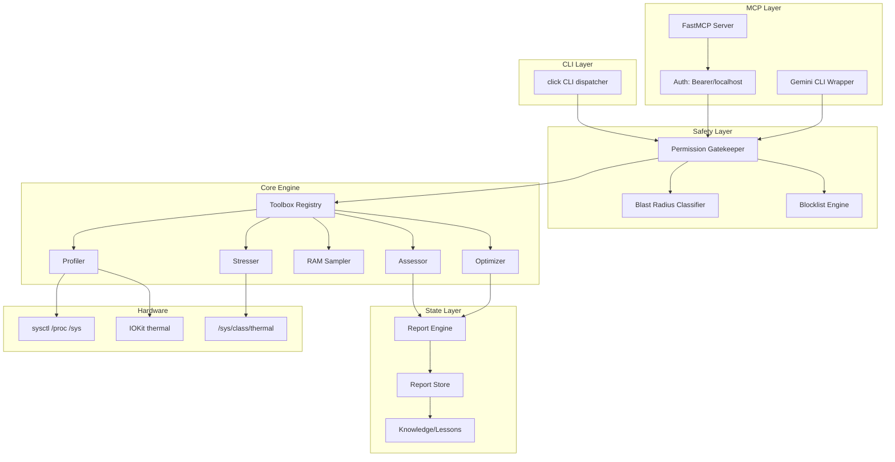
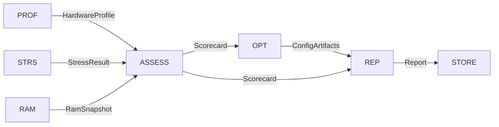
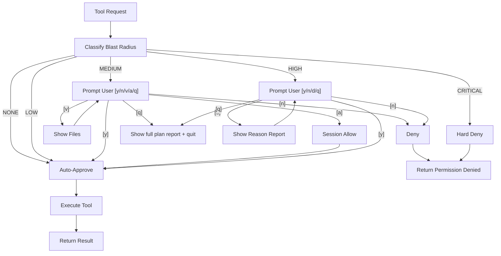
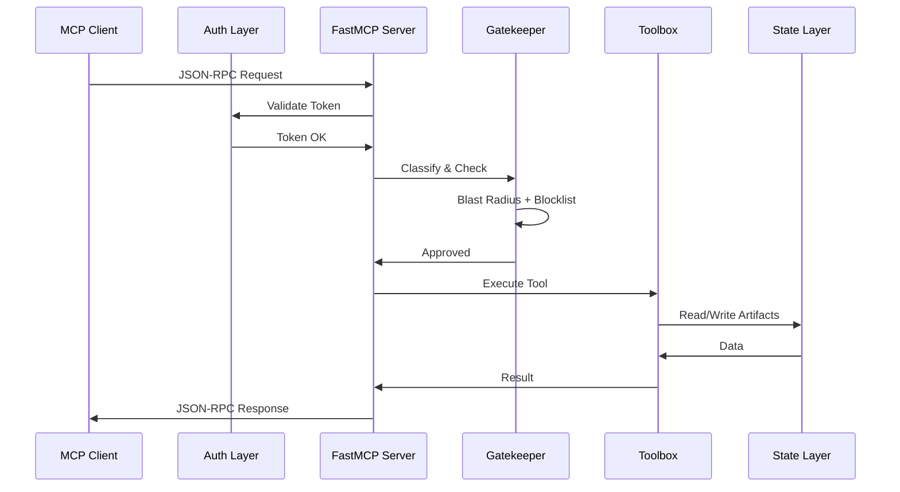
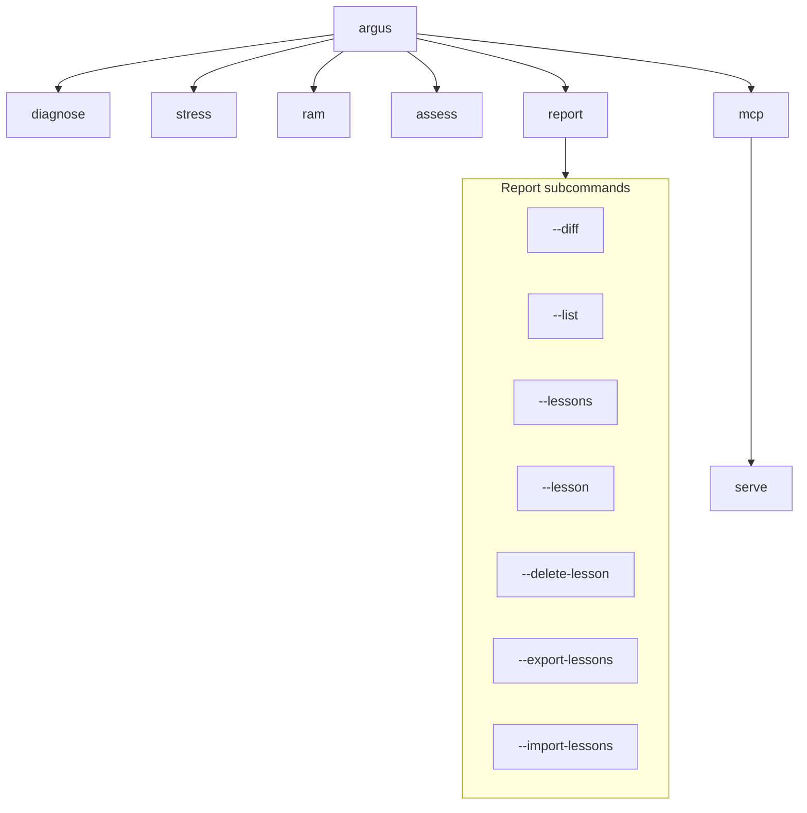
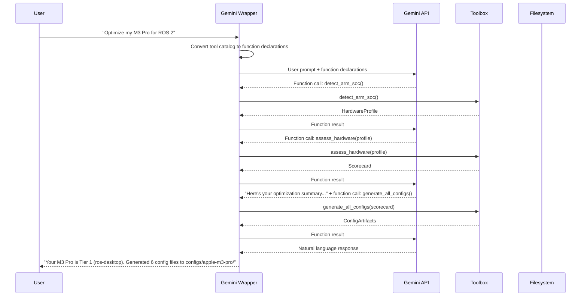
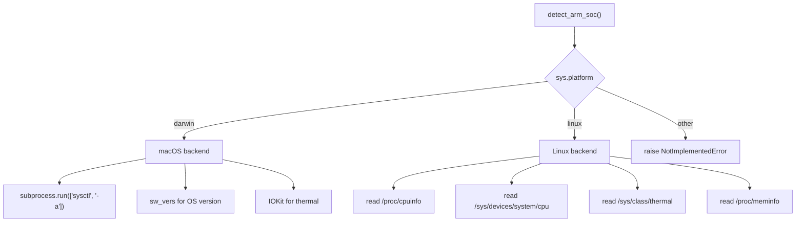
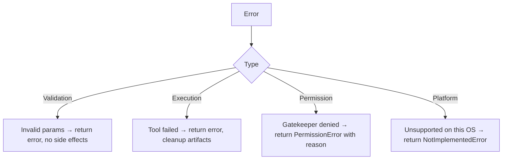

# Argus Architecture Design Document

**Version**: 1.0  
**Date**: 2026-07-10  
**Status**: Draft

---

## 1. System Overview

### 1.1 Purpose & Scope

Argus is an Arm-native MCP-enabled diagnostic and optimization platform for ROS 2. It profiles Arm hardware (CPU, memory, thermal, ISA features), assesses suitability for ROS 2 across 5 variant tiers, generates optimized configuration artifacts (DDS, sysctl, build flags), and captures optimization knowledge as reusable lessons.

### 1.2 High-Level Architecture



### 1.3 Modes of Operation

| Mode | Entry Point | Transport | Use Case |
|---|---|---|---|
| **CLI** | `argus <command>` | Local process | Interactive diagnostic & optimization |
| **MCP Server** | `argus mcp serve` | stdio or HTTP | AI agent integration (Claude Code, etc.) |
| **Gemini Wrapper** | `python scripts/argus_mcp_gemini.py` | Direct Python import | Standalone Gemini-based optimization |

---

## 2. Component Architecture

### 2.1 Core Engine Dependency Graph



#### 2.1.1 Data Flow: Full Diagnostic Pipeline

```
detect_arm_soc()  ──► HardwareProfile ──┐
stress_cpu()      ──► StressResult   ──┤
stress_memory()   ──► StressResult   ──► assess_hardware() ──► Scorecard
measure_thermal() ──► ThermalResult  ──┘                          │
measure_ram()     ──► RamSnapshot    ──► assess_hardware()        │
                                                                  ▼
                                                         generate_*_config()
                                                                  │
                                                                  ▼
                                                         ConfigArtifacts
                                                                  │
                                                                  ▼
                                                         generate_report()
                                                                  │
                                                                  ▼
                                                         Report + Lesson
```

### 2.2 Safety Layer

Every tool call — whether from CLI, MCP, or Gemini wrapper — passes through the safety layer before execution:



### 2.3 MCP Layer



#### 2.3.1 FastMCP Lifecycle

```
1. __init__():   Register tools, resources, prompts
2. run():        Start transport listener (stdio or HTTP)
3. Accept:       Incoming JSON-RPC connection
4. Dispatch:     Method → tool → gatekeeper → execute → respond
5. Shutdown:     Cleanup, close transport
```

### 2.4 State Layer

Reports and lessons are stored on disk in a versioned directory structure:

```
~/.argus/
└── reports/
    └── {fingerprint[:12]}/
        ├── {YYYYMMDD}-{HHMMSS}-{reason}.json   (Report)
        └── lessons.json                          (Append-only lesson store)
```

### 2.5 CLI Layer



---

## 3. Sequence Flows

### 3.1 CLI: `argus assess --report`

```mermaid
sequenceDiagram
    participant User as User
    participant CLI as Click CLI
    participant Gate as Gatekeeper
    participant Prof as Profiler
    participant Stress as Stresser
    participant Assess as Assessor
    participant Opt as Optimizer
    participant Report as Report Engine
    participant FS as Filesystem

    User->>CLI: argus assess --report
    CLI->>Gate: classify(generate_all_configs)
    Gate->>Gate: Blast Radius = MEDIUM
    Gate-->>CLI: ASK
    CLI-->>User: [y/n/v/a/q]
    User-->>CLI: y

    CLI->>Prof: detect_arm_soc()
    Prof-->>CLI: HardwareProfile

    CLI->>Stress: stress_cpu(duration_s=10)
    Stress-->>CLI: StressResult

    CLI->>Assess: assess_hardware(profile, stress)
    Assess-->>CLI: Scorecard

    CLI->>Opt: generate_all_configs(scorecard)
    Opt-->>CLI: ConfigArtifacts

    CLI->>Opt: generate_report(profile, scorecard, configs)
    Opt-->>CLI: Report

    CLI->>Report: generate_report()
    Report-->>CLI: Report Data

    CLI->>FS: write reports/{fingerprint}/...
    FS-->>CLI: OK

    CLI-->>User: Summary + "[y/N] Save lesson?"
```

### 3.2 MCP: `generate_cyclonedds_config`

```mermaid
sequenceDiagram
    participant Client as AI Client
    participant MCP as FastMCP
    participant Gate as Gatekeeper
    participant Opt as Optimizer
    participant FS as Filesystem

    Client->>MCP: tools/call(generate_cyclonedds_config)
    MCP->>MCP: Parse tool name + params
    MCP->>Gate: classify(generate_cyclonedds_config)
    Gate->>Gate: Blast Radius = NONE
    Gate-->>MCP: AUTO-APPROVE

    MCP->>Opt: generate_cyclonedds_xml(scorecard)
    Opt-->>MCP: XML string

    MCP->>FS: write configs/{model}/cyclonedds.xml
    FS-->>MCP: OK

    MCP-->>Client: { result: { xml: "...", path: "..." } }
```

### 3.3 Gemini Wrapper: Single Prompt



---

## 4. Deployment Views

### 4.1 macOS arm64 (Development + Demo)

```
┌─────────────────────────────────────────┐
│  macOS arm64 (Apple Silicon)             │
│  ┌─────────────────────────────────┐    │
│  │ Python 3.11+                     │    │
│  │  ├── argus package               │    │
│  │  ├── google-genai (optional)     │    │
│  │  └── mcp (via FastMCP)           │    │
│  └─────────────────────────────────┘    │
│  ┌─────────────────────────────────┐    │
│  │ Native: sysctl, IOKit, pmset    │    │
│  └─────────────────────────────────┘    │
└─────────────────────────────────────────┘
```

### 4.2 Linux aarch64 (Pi 4/5, Jetson)

```
┌─────────────────────────────────────────┐
│  Linux aarch64 (Raspberry Pi / Jetson)   │
│  ┌─────────────────────────────────┐    │
│  │ Python 3.11+                     │    │
│  │  ├── argus package               │    │
│  │  ├── stress-ng (optional)        │    │
│  │  └── pyhwloc (optional)          │    │
│  └─────────────────────────────────┘    │
│  ┌─────────────────────────────────┐    │
│  │ Native: /proc/cpuinfo, /sys/    │    │
│  │         /sys/class/thermal,     │    │
│  │         /sys/devices/system/cpu │    │
│  └─────────────────────────────────┘    │
└─────────────────────────────────────────┘
```

---

## 5. Cross-Platform Strategy

### 5.1 Platform Detection



### 5.2 Detection Backend Details

| Feature | macOS | Linux |
|---|---|---|
| SoC Model | `sysctl machdep.cpu.brand_string` | `/proc/cpuinfo` model name |
| Core Count | `sysctl hw.ncpu` | `nproc` or `/proc/cpuinfo` |
| Cache Line | `sysctl hw.cachelinesize` | `getconf LEVEL1_DCACHE_LINESIZE` |
| RAM | `sysctl hw.memsize` | `/proc/meminfo MemTotal` |
| Thermal | IOKit (`IOKit/hidsystem/IOHIDEventSystem.h`) | `/sys/class/thermal/*/temp` |
| ISA Features | `sysctl hw.optional.*` | `/proc/cpuinfo Features` |
| Board Model | `hw.model` | `/proc/device-tree/model` or `/sys/firmware/devicetree/` |

### 5.3 Optional pyhwloc Enrichment

```python
try:
    import hwloc
    topology = hwloc.Topology()
    # Enrich with NUMA node info, cache hierarchy depth
except ImportError:
    pass  # Graceful fallback to OS-native + psutil
```

---

## 6. Error Handling Strategy

### 6.1 Error Classification



### 6.2 Error Mapping

| Layer | Error Type | HTTP Code (MCP) | Exit Code (CLI) | Recovery |
|---|---|---|---|---|
| CLI | Invalid argument | — | 1 | Show usage |
| CLI | Tool failed | — | 2 | Show error + hint |
| CLI | Permission denied | — | 3 | Show reason + options |
| CLI | Platform unsupported | — | 4 | Show supported platforms |
| MCP | Invalid params | -32602 | — | Return error object |
| MCP | Internal error | -32603 | — | Return error + traceback |
| MCP | Permission denied | -32000 | — | Return error + gatekeeper reason |
| MCP | Timeout | -32001 | — | Return error + timeout info |

### 6.3 Graceful Degradation Patterns

- **Thermal sensor missing**: Return `None` for temp fields, continue with available metrics
- **ISA detection fails**: Default to NEON-only, note reduced capabilities in report
- **pyhwloc import fails**: Use `psutil` + OS-native data, continue transparently
- **Blocked command**: Return explanatory message referencing the rule, not raw error
