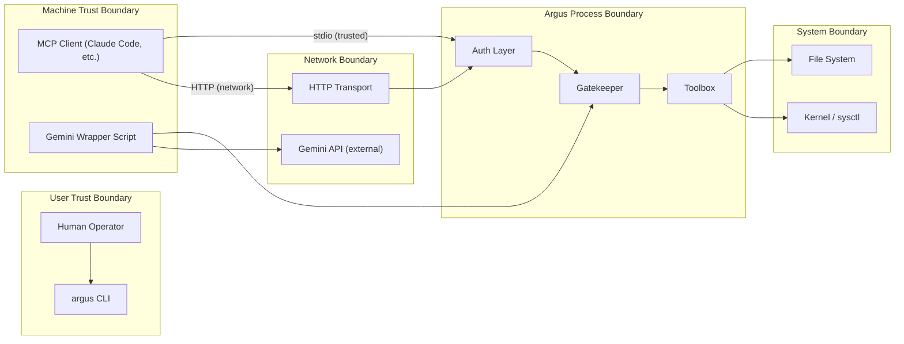
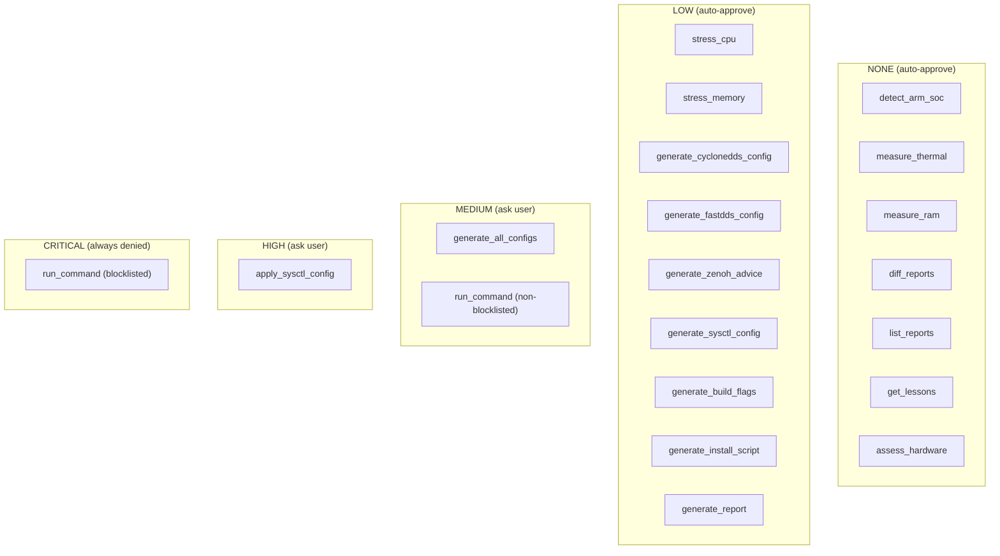
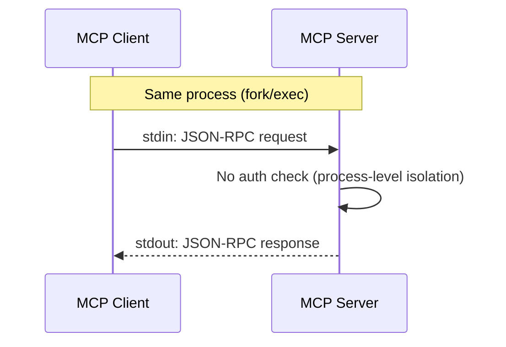
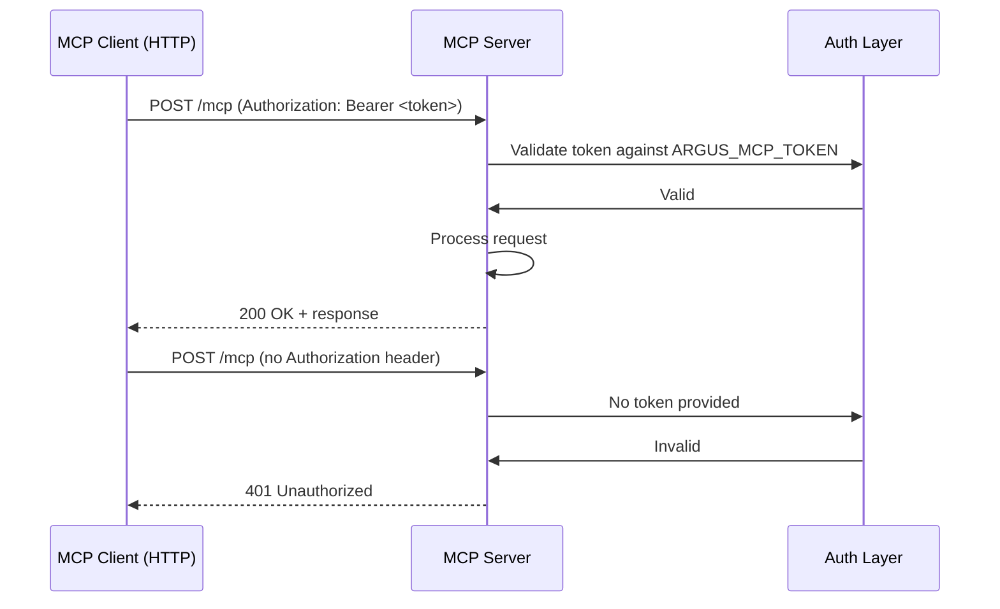

# Argus Security & Safety Document

**Version**: 1.0  
**Date**: 2026-07-10  
**Status**: Draft

---

## 1. Threat Model

### 1.1 Assets

| Asset | Sensitivity | Location | Impact if Compromised |
|---|---|---|---|
| Hardware profile | Low | Memory, report store | Minor info disclosure (SoC model, RAM) |
| Generated configs | Medium | configs/ directory | Modified DDS/system configs → degraded perf |
| Kernel parameters | High | sysctl.conf | System instability if wrong values applied |
| Report store | Low | ~/.argus/reports/ | Loss of optimization history |
| Gemini API key | Critical | Env var ARGUS_GEMINI_KEY | Unauthorized API usage, cost |
| MCP Bearer token | Critical | Env var ARGUS_MCP_TOKEN | Unauthorized MCP access |

### 1.2 Trust Boundaries



### 1.3 Attack Vectors

| Vector | Description | Mitigation |
|---|---|---|
| Malicious MCP client | Attacker sends arbitrary tool requests via HTTP | Bearer token, localhost-only default |
| HTTP replay attack | Captured valid request replayed later | Token rotation, TLS (Phase 3) |
| Config injection | Malicious config generation request | Gatekeeper MEDIUM/HIGH classification |
| Argument injection | Tool called with crafted params | Validation on all parameters |
| Lesson store poisoning | Malicious lesson data written | JSON schema validation, append-only |
| API key leakage | Gemini key exposed in logs/process list | Never logged, env var only |
| Privilege escalation | Tool breaks out of intended operation | Blocklist regex engine |

---

## 2. Gatekeeper Design

### 2.1 Blast Radius Classification



### 2.2 Evaluation Order

```
For every tool call:

1. Extract command string (if run_command: full arg string)
2. Check BLOCKLIST:
   - If regex pattern matches → DENIED (with rule reference)
3. Determine BLAST RADIUS:
   - Look up tool in classification table
   - If unknown → default to HIGH
4. Apply default action:
   - NONE/LOW → APPROVED
   - MEDIUM/HIGH → ASK user
   - CRITICAL → DENIED
5. If ASK:
   - Render prompt based on radius level
   - Process user response
   - Honor session allow if set
```

### 2.3 Deny Rules

Denied commands are always blocked, regardless of user input:

- Patterns matching filesystem destruction (`rm -rf /`, `dd if=/dev/zero of=/dev/sda`)
- System modification without going through Argus tools (`sysctl -w` directly)
- Process termination (`kill -9`, `pkill`)
- Network manipulation (`iptables`, `ifconfig down`)
- Package manager modification (`apt remove`, `dpkg --purge`)
- Arbitrary shell execution (`eval`, `exec`, `source /etc`)

### 2.4 Ask Rules

| Radius | Prompt Options | Default Timeout |
|---|---|---|
| MEDIUM | `[y]es [n]o [v]iew [a]llow [q]uit` | 60 seconds |
| HIGH | `[y]es [n]o [d]etails [q]uit` | 60 seconds |

### 2.5 Allow Rules (Session Override)

- `[a]` sets a session-level allow flag for that specific tool
- Expires when the process exits
- Does NOT apply across MCP connections
- Logged in audit trail with `"session_allow": true`

---

## 3. Blocklist Rules

### 3.1 Pattern-Based Rules

```python
BLOCKLIST_RULES = [
    {
        "name": "filesystem_destruction",
        "pattern": r"\brm\s+-rf\s+/",
        "description": "Recursive root filesystem deletion",
        "severity": "CRITICAL"
    },
    {
        "name": "block_device_write",
        "pattern": r"\bdd\s+if=.*\s+of=\s*/dev/",
        "description": "Direct block device write",
        "severity": "CRITICAL"
    },
    {
        "name": "kernel_param_direct",
        "pattern": r"\bsysctl\s+-w\b",
        "description": "Direct kernel parameter modification",
        "severity": "HIGH"
    },
    {
        "name": "process_kill",
        "pattern": r"\b(kill|pkill|killall)\s+-?9?\b",
        "description": "Forceful process termination",
        "severity": "HIGH"
    },
    {
        "name": "package_remove",
        "pattern": r"\b(apt|dpkg|pacman|yum)\s+(remove|purge)\b",
        "description": "Package removal",
        "severity": "HIGH"
    },
    {
        "name": "arbitrary_exec",
        "pattern": r"\b(eval|exec)\s+\S+",
        "description": "Arbitrary code execution",
        "severity": "CRITICAL"
    },
    {
        "name": "sudo_escalation",
        "pattern": r"\bsudo\b",
        "description": "Privilege escalation via sudo",
        "severity": "HIGH"
    },
    {
        "name": "network_modification",
        "pattern": r"\b(iptables|ifconfig|ip\s+link\s+set)\b",
        "description": "Network configuration modification",
        "severity": "MEDIUM"
    }
]
```

### 3.2 Rule Matching

- Rules evaluated in order (most dangerous first)
- First match wins
- All rules logged in audit trail regardless of match
- Rules can be extended via `~/.argus/blocklist_rules.yaml` (Phase 2)

---

## 4. Auth Flows

### 4.1 stdio Transport



- No auth required: process boundary provides isolation
- Only local processes can connect to stdio

### 4.2 HTTP Transport (MVP: Bearer Token)



- Token set via `ARGUS_MCP_TOKEN` environment variable
- Default: localhost-only bind
- Token validation: constant-time comparison to prevent timing attacks

### 4.3 Token Generation

```bash
# Generate a secure random token
python -c "import secrets; print(secrets.token_urlsafe(32))"

# Export for Argus
export ARGUS_MCP_TOKEN="$(python -c 'import secrets; print(secrets.token_urlsafe(32))')"
```

### 4.4 Phase 3: OAuth 2.1 + PKCE

Future enhancement not in MVP scope:
- OAuth 2.1 authorization code flow
- PKCE (Proof Key for Code Exchange)
- Token refresh mechanism
- Scoped permissions per tool

---

## 5. Audit Logging

### 5.1 Log Format

```
audit.log (CSV-like, pipe-delimited for readability):

2026-07-10T14:30:00Z | detect_arm_soc    | NONE    | approved       | auto-classified
2026-07-10T14:30:05Z | generate_all_configs | MEDIUM | approved    | user:[y]  session:false
2026-07-10T14:30:10Z | run_command       | CRITICAL | denied        | rule:filesystem_destruction pattern:rm -rf /
```

### 5.2 Log Location

- `~/.argus/audit.log` (append-only, auto-rotated)

### 5.3 What Gets Logged

| Field | Always Logged? | Notes |
|---|---|---|
| Timestamp | Yes | ISO 8601 UTC |
| Tool name | Yes | |
| Blast radius | Yes | |
| Decision | Yes | approved / denied / asked |
| Reason | Yes | rule name, user choice, auto-class |
| Token | Never | |
| Full command | No | Only matched pattern, not full args |
| User response | Yes | [y], [n], [a], [q] |

### 5.4 Sensitive Data Policy

- `ARGUS_MCP_TOKEN` never logged, never exposed in error messages
- `ARGUS_GEMINI_KEY` never logged
- Command arguments truncated to prevent credential leakage
- Lesson content logged only if explicitly saved by user
