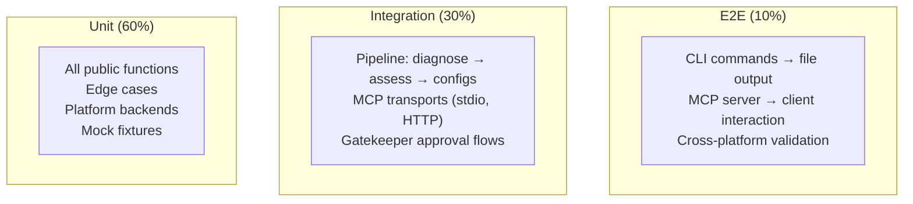

# Argus Testing & QA Plan

**Version**: 1.0  
**Date**: 2026-07-10  
**Status**: Draft

---

## 1. Testing Strategy

### 1.1 Test Pyramid



### 1.2 Framework

- **Test framework**: pytest (with pytest-asyncio for async MCP tests)
- **Coverage**: pytest-cov (target: 85%+ line coverage)
- **Mocking**: pytest-mock, custom mock fixtures
- **Directory**: `tests/` at project root

### 1.3 Test File Structure

```
tests/
├── conftest.py                      # Shared fixtures, mock data
├── test_profiler.py                 # detect_arm_soc, fingerprint
├── test_stresser.py                 # stress_cpu, stress_memory, thermal
├── test_ram_sampler.py             # sample_ram, system RAM stats
├── test_assess.py                   # assess_hardware, tier scoring
├── test_optimizer.py               # All generate_* functions
├── test_gatekeeper.py               # Blast radius, blocklist, prompts
├── test_report.py                   # Report generation, diff, serialization
├── test_lessons.py                  # Lesson CRUD, persistence
├── test_mcp_server.py              # FastMCP tool registration, resource serving
├── test_mcp_http.py                # HTTP transport, Bearer auth
├── test_cli.py                      # Click command dispatch
├── fixtures/
│   ├── sysctl_m3pro.txt
│   ├── sysctl_m1.txt
│   ├── cpuinfo_pi5.txt
│   ├── cpuinfo_pi4.txt
│   └── cpuinfo_jetson.txt
└── data/
    ├── sample_report.json
    └── sample_lessons.json
```

---

## 2. Unit Test Cases

### 2.1 `profiler.py`

| # | Test | Input | Expected | Mock |
|---|---|---|---|---|
| P1 | detect_arm_soc macOS | (none, injected sysctl output) | All fields populated, non-empty | `subprocess.run(["sysctl", "-a"])` |
| P2 | detect_arm_soc Linux | (none, injected /proc/cpuinfo) | All fields populated, non-empty | `open("/proc/cpuinfo")` |
| P3 | fingerprint determinism | Same profile twice | Same fingerprint string | — |
| P4 | fingerprint sensitivity | Different model → different fingerprint | Different 64-char strings | — |
| P5 | get_cache_line_size | macOS | 128 | sysctl mock |
| P6 | get_cache_line_size | Linux | 64 | getconf mock |
| P7 | get_compiler_target | macOS "apple-m3" | `apple-m3` | sysctl mock |
| P8 | get_compiler_target | Linux "cortex-a76" | `cortex-a76` | /proc/cpuinfo mock |
| P9 | detect_arm_soc no sysctl | subprocess failure | Raises RuntimeError | subprocess.CalledProcessError |
| P10 | detect_arm_soc not arm | x86 platform | Raises ValueError | platform.machine = "x86_64" |

### 2.2 `stresser.py`

| # | Test | Input | Expected | Mock |
|---|---|---|---|---|
| S1 | stress_cpu | duration_s=2 | bogo_ops_s > 0 | multiprocessing.Process |
| S2 | stress_cpu workers=4 | duration_s=2, workers=4 | 4 workers used | multiprocessing.Process |
| S3 | stress_memory | duration_s=2 | 4 positive MB/s values | multiprocessing.Process |
| S4 | measure_thermal macOS | — | dict with temp_c > 0 | IOKit mock |
| S5 | measure_thermal Linux | — | dict with temp_c > 0 | /sys/class/thermal mock |
| S6 | measure_thermal no sensor | — | error: "no_thermal_sensor" | Empty /sys/class/thermal |

### 2.3 `ram_sampler.py`

| # | Test | Input | Expected |
|---|---|---|---|
| R1 | sample_ram system | duration_s=3, samples=3 | 3+ samples, all have rss_kb |
| R2 | sample_ram with PID | pid=1 | peak_rss_kb >= avg_rss_kb |
| R3 | sample_ram invalid PID | pid=99999 | Error or empty result |
| R4 | system_available_kb > 0 | — | Positive int |

### 2.4 `assess.py`

| # | Test | Input | Expected |
|---|---|---|---|
| A1 | Tier ros-desktop | 8 cores, 16 GB, full ISA | score >= 80, tier = "ros-desktop" |
| A2 | Tier ros-base | 2 cores, 2 GB, NEON | score 40-60, tier = "ros-base" |
| A3 | Tier zenoh-pico | 1 core, 128 MB | tier = "zenoh-pico" |
| A4 | Score boundary | 8 cores, 8 GB | score >= 80 |
| A5 | Score boundary | 1 core, 128 MB, no NEON | score < 20 |
| A6 | Rationale non-empty | Any profile | Non-empty string |
| A7 | Subscores sum | — | 4 subscores, each 0-100 |

### 2.5 `optimizer.py`

| # | Test | Input | Expected |
|---|---|---|---|
| O1 | generate_cyclonedds_xml | valid Scorecard | Valid XML, contains `<CycloneDDS>` |
| O2 | generate_fastdds_xml | valid Scorecard | Valid XML, contains `<profiles>` |
| O3 | generate_sysctl_config | valid Scorecard | All values positive ints |
| O4 | generate_install_script | ubuntu, ros-desktop | Contains "apt install" |
| O5 | generate_build_flags | apple-m3 target | Contains "-mcpu=native" |
| O6 | generate_build_flags | cortex-a76 target | Contains "-mcpu=cortex-a76" |
| O7 | generate_all_configs | valid Scorecard | Dict with 6 file entries |
| O8 | File path conventions | Scorecard for "Apple M3 Pro" | Path contains "apple-m3-pro" |

### 2.6 `gatekeeper.py`

| # | Test | Input | Expected |
|---|---|---|---|
| G1 | NONE auto-approve | detect_arm_soc | "approved" |
| G2 | LOW auto-approve | stress_cpu | "approved" |
| G3 | MEDIUM ask | generate_all_configs | "ask" |
| G4 | HIGH ask | apply_sysctl | "ask" |
| G5 | CRITICAL deny | run_command | "denied" |
| G6 | Blocklisted pattern | `rm -rf /` | "denied" with rule reference |
| G7 | Blocklisted command | `sudo` | "denied" |
| G8 | Unknown tool | made_up_tool | defaults to HIGH |
| G9 | Allow session | MEDIUM prompted, [a] selected | Subsequent calls auto-approved |
| G10 | Blast radius table complete | Every registered tool | All have classification |

### 2.7 `report.py`

| # | Test | Input | Expected |
|---|---|---|---|
| RP1 | Report serialization | Report object → JSON → Report | Round-trip identical |
| RP2 | Report diff added files | report1 (no configs), report2 (has configs) | `added` list non-empty |
| RP3 | Report diff changed params | report1 (FragmentSize=65536), report2 (131072) | `changed` list items |
| RP4 | Report diff identical | Same report diffed | Empty diff |
| RP5 | Lesson CRUD | Create → Read → Delete | Delete marks as `deleted: true` |
| RP6 | Lesson confidence range | Confidence=150 | Validation error |
| RP7 | Report store listing | 3 reports in store | `list_reports()` returns 3 |

### 2.8 MCP Server

| # | Test | Input | Expected |
|---|---|---|---|
| M1 | Tool registration | detect_arm_soc | Registered in FastMCP |
| M2 | Resource registration | argus://system/info | Registered |
| M3 | Prompt registration | tune-ros2 | Registered |
| M4 | Call unknown tool | "nonexistent" | -32601 error |
| M5 | Call with missing params | `assess_hardware` with bad type | -32602 error |

---

## 3. Integration Test Cases

### 3.1 Diagnostic Pipeline

```python
def test_full_pipeline():
    # 1. Diagnose → profile
    profile = detect_arm_soc()
    assert profile["model"]

    # 2. Stress → performance
    cpu_result = stress_cpu(duration_s=2)
    assert cpu_result["bogo_ops_s"] > 0

    mem_result = stress_memory(duration_s=2)
    assert mem_result["read_mb_s"] > 0

    # 3. Assess → scorecard
    scorecard = assess_hardware()
    assert 0 <= scorecard["score"] <= 100

    # 4. Generate all configs
    configs = generate_all_configs()
    assert len(configs["artifacts"]) == 6

    # 5. Report
    report = generate_report()
    assert report["report_id"]
```

### 3.2 MCP stdio Transport

```python
@pytest.mark.asyncio
async def test_mcp_stdio():
    # Start server, connect via stdio
    # List tools
    # Call detect_arm_soc
    # Read argus://system/info resource
    # Verify responses
```

### 3.3 MCP HTTP Transport

```python
@pytest.mark.asyncio
async def test_mcp_http():
    # Start server on port 0 (random)
    # POST /mcp with Bearer token
    # Call assess_hardware
    # Verify 200 + valid response
```

### 3.4 MCP HTTP Auth Failure

```python
@pytest.mark.asyncio
async def test_mcp_http_no_auth():
    # Start server with ARGUS_MCP_TOKEN="test-token"
    # POST /mcp without Bearer header
    # Verify 401 Unauthorized
```

### 3.5 Gatekeeper Approval Flow

```python
def test_gatekeeper_medium_approve(monkeypatch):
    # Mock stdin to send "y"
    # Call generate_all_configs
    # Verify configs written
```

### 3.6 Gatekeeper Blocked Command

```python
def test_gatekeeper_blocked():
    # Call run_command with "rm -rf /tmp/test"
    # Verify denied, no files deleted
```

---

## 4. Mock Fixtures

### 4.1 macOS sysctl Output

`tests/fixtures/sysctl_m3pro.txt` — 300+ lines of `sysctl -a` output from Apple M3 Pro:

```
machdep.cpu.brand_string: Apple M3 Pro
machdep.cpu.core_count: 12
machdep.cpu.thread_count: 12
hw.cachelinesize: 128
hw.l1dcachesize: 131072
hw.l2cachesize: 16777216
hw.memsize: 38654705664
hw.optional.arm.FEAT_FlagM: 1
hw.optional.arm.FEAT_FlagM2: 1
...
```

### 4.2 Linux /proc/cpuinfo Output

`tests/fixtures/cpuinfo_pi5.txt`:

```
processor   : 0
model name  : ARM Cortex-A76
Features    : fp asimd evtstrm aes pmull sha1 sha2 crc32 atomics fphp asimdhp cpuid asimdrdm lrcpc dcpop asimddp
CPU implementer : 0x41
CPU architecture: 8
CPU part    : 0xd0b
CPU revision: 1
```

### 4.3 Linux /proc/meminfo

`tests/fixtures/meminfo_pi5.txt`:

```
MemTotal:        8178892 kB
MemFree:         5234560 kB
MemAvailable:    6543210 kB
```

### 4.4 Mock Files

- `sysctl_m1.txt` — Apple M1 (8 cores, 8 GB, 128B cache line)
- `cpuinfo_pi4.txt` — Pi 4 (Cortex-A72, 4 cores, 64B cache line)
- `cpuinfo_jetson.txt` — Jetson Orin (12-core Cortex-A78AE, 64B cache line)
- `thermal_zones/` — Directory with mock `/sys/class/thermal/thermal_zone*/temp` files

---

## 5. Cross-Platform Test Matrix

| Test | macOS arm64 | Linux aarch64 (Pi 4/5) | Notes |
|---|---|---|---|
| detect_arm_soc | ✅ sysctl backend | ✅ /proc backend | Different code paths |
| stress_cpu | ✅ multiprocessing | ✅ multiprocessing | Same code, diff thermal backend |
| stress_memory | ✅ | ✅ | Same code |
| measure_thermal | ✅ IOKit | ✅ /sys/class/thermal | Different backend, same API |
| measure_ram | ✅ | ✅ | Same code |
| assess_hardware | ✅ | ✅ | Same logic, diff input |
| generate_*_config | ✅ | ✅ | Pure logic, platform-independent |
| generate_report | ✅ | ✅ | Pure logic |
| gatekeeper | ✅ | ✅ | Same code |
| MCP stdio | ✅ | ✅ | Same code |
| MCP HTTP | ✅ | ✅ | Same code |

### Test Command

```bash
# All tests
pytest tests/ -v --cov=argus --cov-report=term-missing

# Specific module
pytest tests/test_profiler.py -v

# Cross-platform (run on each target)
pytest tests/ -v -k "not mcp_http"  # Skip HTTP tests if no server

# Coverage threshold
pytest tests/ --cov=argus --cov-fail-under=85
```

---

## 6. QA Pass/Fail Checklist

| # | Check | Pass Criteria | Manual/Automated |
|---|---|---|---|
| QA1 | All unit tests pass | 0 failures, 0 errors | Automated |
| QA2 | Integration tests pass on macOS | Full pipeline completes | Automated |
| QA3 | Integration tests pass on Pi 4 | Full pipeline completes | Automated on Pi |
| QA4 | Coverage ≥ 85% | pytest-cov ≥ 85% | Automated |
| QA5 | Gatekeeper prompts render | `argus assess` shows correct prompt | Manual |
| QA6 | Gatekeeper [y/n/v/a/q] all work | Each path produces correct outcome | Manual |
| QA7 | MCP Inspector discovers all tools | All 17 tools listed | Manual |
| QA8 | Gemini wrapper 3 test prompts | Returns natural language | Manual |
| QA9 | README examples produce output | Each example runs without error | Manual |
| QA10 | pip install -e . clean venv | Clean install succeeds | Manual |
| QA11 | No secrets in code | No hardcoded keys, tokens | Automated (grep) |
| QA12 | Validate MCP JSON-RPC compliance | All code 2.0 spec | Manual review |

### QA Test Prompts for Gemini Wrapper

1. `"Optimize my M3 Pro for ROS 2"`
   - Expect: hardware detected, configs generated, report saved
2. `"What's the difference between my Pi 4 and Pi 5?"`
   - Expect: two fingerprints diffed, comparison shown
3. `"Should I use micro-ROS on this device?"`
   - Expect: tier analysis + recommendation
